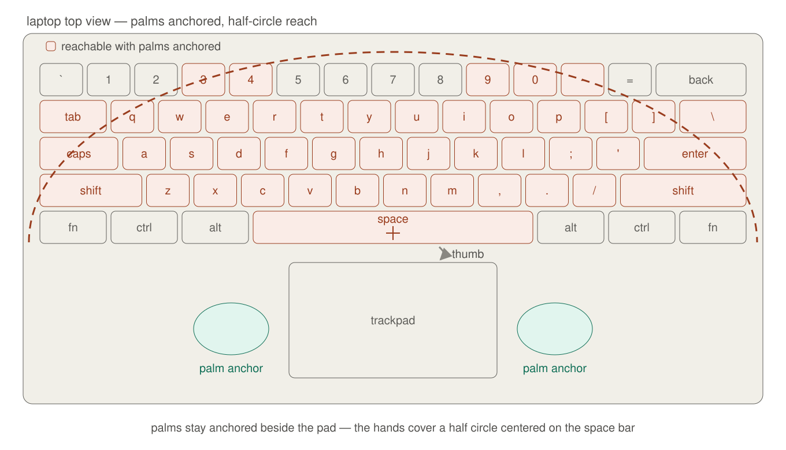
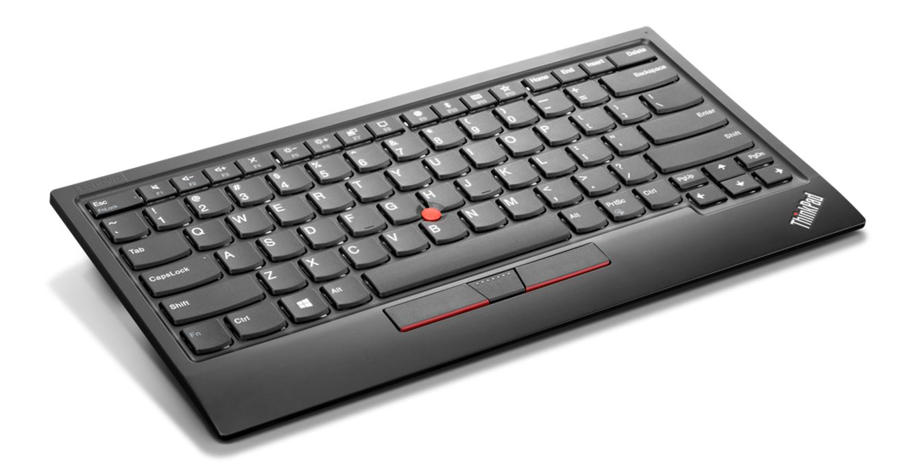
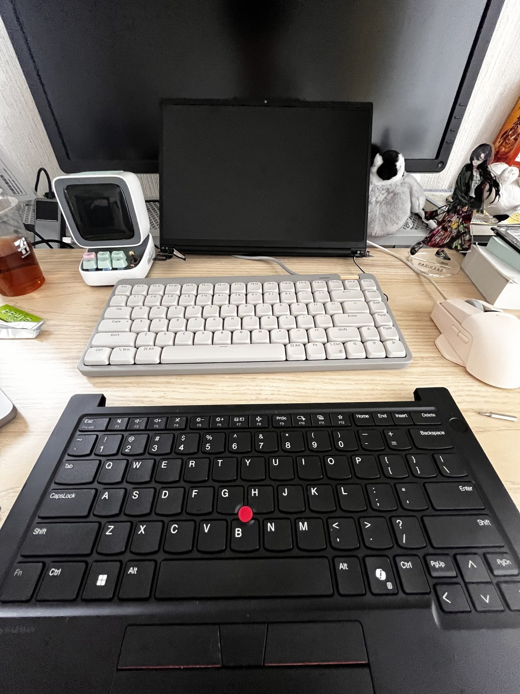
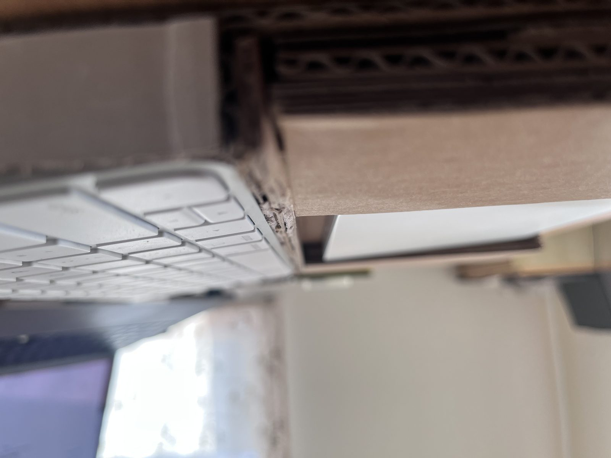
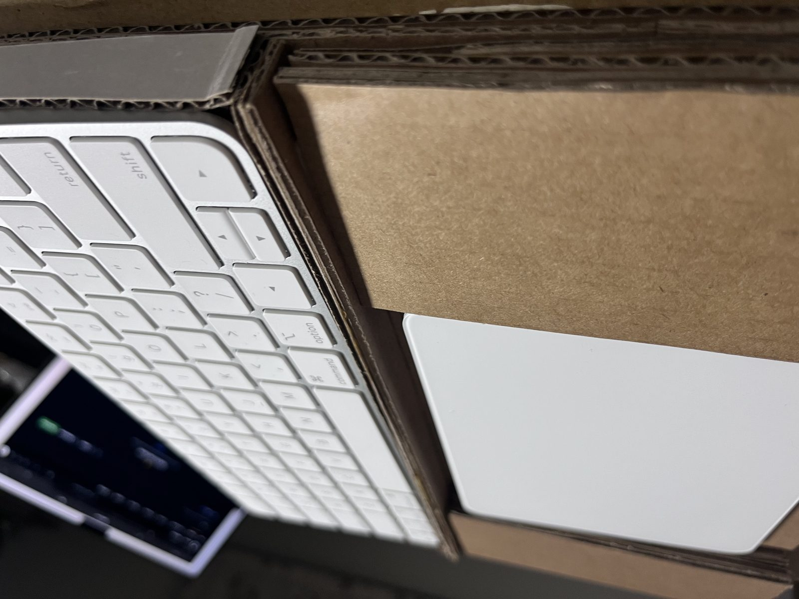
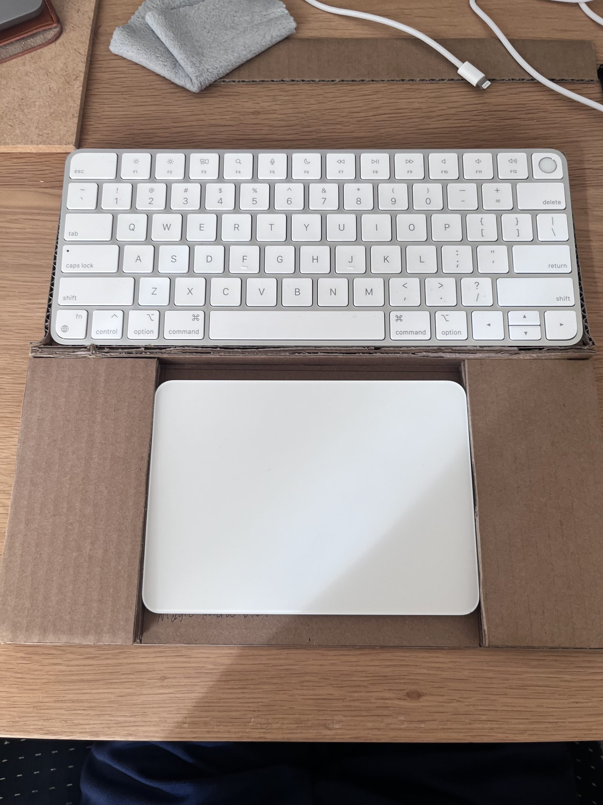

= ラップトップに慣れすぎた

私はコンピューターに触れ始めてから6,7年経っていますが、デスクトップを使っていたのは2年ほど。最初は家にあったHPのとても*lap(膝)* には置けなそうな分厚いcompaqモデル、その後は買ってもらったASUSの安いN4000 PC, そこから1,2年間ほど自作PCとmac miniを、そこから現在まではThinkPadがメイン。

人生のパソコン時間の2/7をラップトップキーボードで過ごしたわけです。すると、どうしたってラップトップの癖がが手に馴染みます。

例えば、パームレスト。大抵のラップトップは本体の2/3をキーボード、残り手前の1/3をトラックパッドに割り当てて、パッドの左右がパームレスト的な役割をします。

そしてこれは人に依るとは思いますが、私は掌根(小指下の手のひらの盛り上がってるパーツ)をそのパームレスト(仮)に固定してキーボードを使います。マウスカーソルを使う際にはそのまま下に余った親指でトラックパッドを使います。#footnote[あまり手の大きい方ではないので、完全なホームポジションには固定できないので割と動いてはいる。固定状態でのキーカバー範囲はアルファベットと記号ら辺が限界なのでそれより外はちょっと無理して打ってる。Shift同時押しとか厳しい]

これらのメリットはなるべく手を離さずに扱える点です。マウスはマウスカーソル操作のたびに手を離す必要があり面倒です。ずっとマウスを使う作業ならともかく、私は基本的に文字を扱っているのでキーボードが主な入力装置です。それでいてniriとvimを使っているタイプの人間なのでトラックパッドの手を動かさずにマウスカーソルを動かせるのは有難い環境です。#footnote[ThinkPadの赤ポチはどうにも慣れなくて使えない]

---

余談ですが私はnvimのLeaderキーをspaceにしたり、CtrlとAltをスワップしたりすることで、頻出修飾キーを親指で押せるようにしています。

---

= デスクトップだとトラックパッドがない

ないわけではないですが、あまりないです。Macなら純正のMagic Trackpadがあり、個人的にAppleの2番目に好きな製品(1番はEarPods)です。デスクトップでもあのいい感じのTrackpadを使えるのはいいと思います。デスクトップMacユーザーは黙ってアレを買っておけばいいです。

しかし私は現状としてLinuxを使っており、Magic Trackpadをフルスペックで使えるマシンとLinuxの相性はあまり良くないので現実的ではないです。そして市販されている外部トラックパッドもあまりいい製品が多いとも言えず(あんまり調べてないのでテキトウ言ってますが、調べるコストが高い時点で個人的にはアウト)...

で、もっと言えば左右分割パームレストも用意しないといけない。これはまあ多くの製品があるとは思うのでまあいいでしょう。

== しかし、キーが高い。薄い製品が少ない。

値段の話ではないです。(いや高いけども)

具体的な数字を持ち合わせていませんが、パンタグラフ式のキーボード少なくない? という印象があります。というかいい感じの値段のものが少ないといいいますか。いい感じのキーボードの製品群、具体的には5000円を超えたくらいの群の中だと、圧倒的にメカニカル式が多く感じます。おもにゲーム用途なのか知りませんが謎に怪しいメカニカルキーボード(5,299円)みたいな製品は多いです。しかしその価格帯のパンタグラフはあまり見かけません。

_"Keychron B1 Pro"(6,930円)_ とかがありますが、それくらいでメジャーな製品群では無いよう... 個人的に一番良かったのはlogicoolの _"MX Keys Mini"_ ですが、価格が上がってしまったのと、国内だとUS配列がMac版にしか無いので選択肢から外れてしまいます... #footnote[本当に国内でUS配列手に入れるの難しい。ラップトップは特に。MacBookかThinkPadかDellの高級モデルくらいでは]

で、なんでパンタグラフかと言えば大抵のラップトップはパンタグラフキーボードで私がそれに慣れてしまっているからです。言わずもがなですね。

一時期ロープロファイルのキーボードも使っていたのですが、どうしてもキーの押し込みが深くて、指が届かないというか押し込んだあとに周りのキーを巻き込むなどあって、慣れる事ができませんでした...

あと、さっきのパームレストの話と繋がりますが、パンタグラフの薄いキーボードを使うと今度はパームレストが邪魔になります。そしてこれはmacでmagic keyboardとmagic Trackpadを使っていた経験からですが、それらの前後置きは割と面倒で専用のパームレストを作ったりして工夫しようとしましたが、やはり使いやすくはなく断念した思い出があります。

= 理想はThinkPad without Monitor?

[こういった](https://support.lenovo.com/jp/ja/accessories/acc500164-thinkpad-trackpoint-keyboard-ii-overview-and-service-parts)製品もあるにはあるんですが、トラックパッドないしなぁと。(ThinkPad的には赤ポチあるからいいだろ判定でしょうけど)

こういう感じにキーボード部分だけを取り出したようなデバイスが欲しい...

= 余談

この記事のslugの`fingers file complaint`は`指が苦情を出してくる`という英語圏?のジョークだそうです。

> No matter how good it is, if the layout's different, my fingers just file a formal complaint.\
> — 「指が正式に苦情を出してくる」

> My muscle memory has veto power over my wallet.\
> — 「マッスルメモリーが財布に拒否権を持ってる」

> I want it, my brain wants it, but my pinky says no.\
> — 小指だけ反対してる

などの表現があるそう。これらはおもに配列とかの話でしょうね。英語圏の無生物等々を主語にする文化は割と好き。

---

あと、途中で出てきた自作パームレスト。木の加工とか面倒だったのでダンボールです。ちゃんとしたのは探せば売ってそう。

:::image-row

:::
