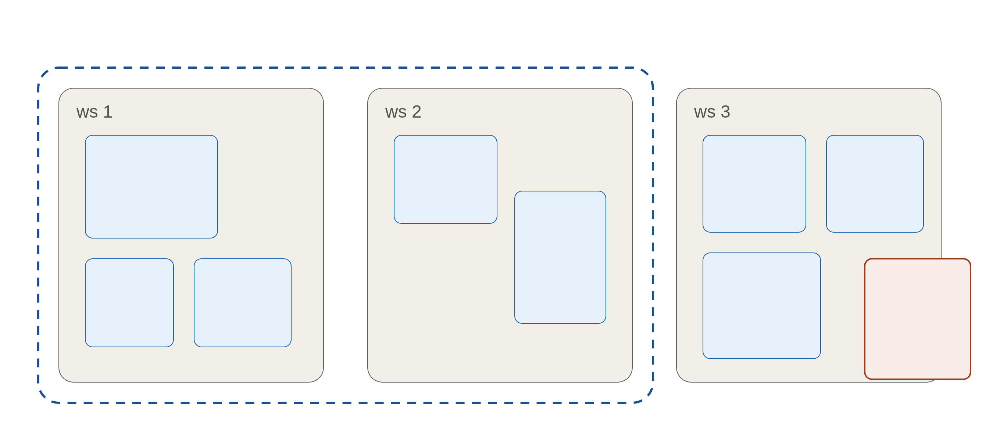
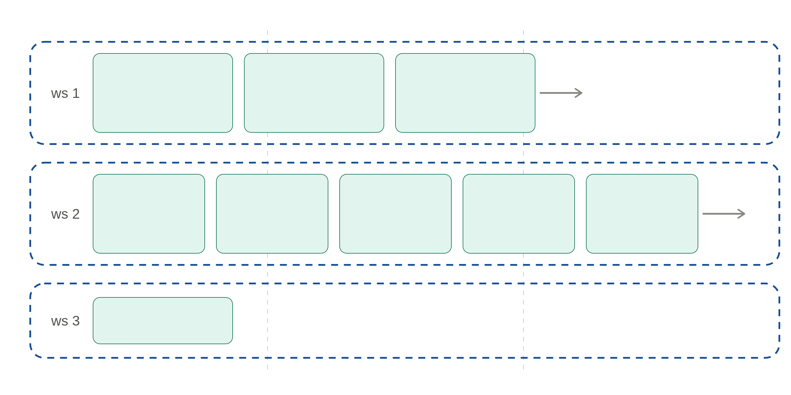
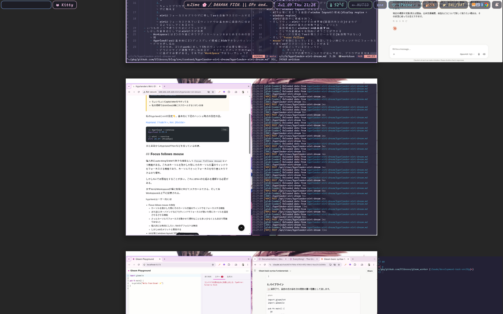
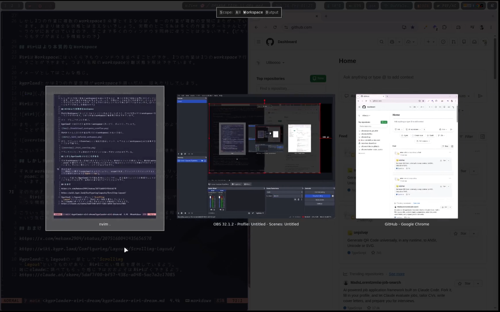

:::message
注意点

- ちょいちょいCapital letterをサボってる
- 私の理解ではniriのwsは横にスクロールするリボン全体
  :::

私のhyprlandとniriの設定👇。基本的に下記のハッシュ時点の設定の話。

[Hyprland: 77cdb74](https://github.com/Uliboooo/dotfiles/tree/beef43bedab85c4ce457cd61fea7b44febc9a0ee/.config/hypr), [Niri: beef43b](https://github.com/Uliboooo/dotfiles/tree/beef43bedab85c4ce457cd61fea7b44febc9a0ee/.config/niri)

```bash
:) hyprland --version
Hyprland 0.55.4

:) niri --version
niri 26.04 (Nixpkgs)
```

また普段からHyprlandやNiriなどを使っている前提。

## Niriの方がより正しいWorkspaceに感じる

そもそもHyprlandとNiriのもっとも大きな違いであり特徴は**無限スクロール**でしょう。

#quote(attribution: "Niri - Github", url: "https://github.com/niri-wm/niri")[
Windows are arranged in columns on an infinite strip going to the right. Opening a new window never causes existing windows to resize.
]

そしてこのNiriの**無限スクロール**は本質的にHyprlandよりworkspaceの概念に近いように感じました。

## そもそもWorkspaceって何よ?

私の理解では1つの作業を行うための空間です。Windowsの仮想デスクトップやmacOSのSpaceのような。そしてHyprlandのWorkspaceも多くの人はそういう使い方をしているでしょう。しかしそれらのWorkspaceとして提供される空間は1つの表示領域(多くはモニター)に限られます。WindowsやmacOS, KDE, GNOMEなどのstackingなものなら隠すなどの操作もありますが、Hyprlandはそうはいきません。もしWorkspaceからウィンドウがこぼれるのならば別のworkspaceに逃がすかするかして現在の表示を確保する必要があります。

しかし1つの作業に複数のworkspaceを必要とするならば、単一の作業が複数の空間にまたがっています。あまり健全な状態とは言えないでしょう。実際のところ私は多くの作業をターミナルとブラウザにあずけているので、そこまで多くのウィンドウを同時に使うことは少ないです。(どちらもタブがあるし多機能なので)

## Niriはより本質的なWorkspace

NiriはWorkspaceにはいくらでもウィンドウを並べることができ、1つの作業は1つのworkspaceで行うことができます。つまり先程のworkspace分離状態を解決できています。

イメージとしてはこんな感じ。

hyprlandとかは1つの作業空間がworkspaceを跨いだり、溢れたりしてしまう。



Niriはちゃんと1つの作業空間が1つのworkspaceに対応する感じ。青色が1つの作業です。



また、デフォルトでOverviewという機能を搭載していて、以下のようにworkspaces全体を俯瞰することが可能です。



こういうベーシックな機能がプラグインとか無しで使えるのは便利ですね。

## しかしHyprlandもいいところがある

それはworkspaceが表示領域に収まるということです。Niriのメリットの裏返しです。Niriはworkspcaeに必要なだけのウィンドウを保有できる代わりに特定のウィンドウへの移動が下手になっています。見えない場所にウィンドウがあるためです。

そのため?、Niriには標準でoverviewがあるのでしょうし、scopeを指定してウィンドウをスイッチするような機能もあります(`Super + Tab`)。



こういった面ではHyprlandの方が認知負荷は小さいですし、ある程度ウィンドウの整理をしようという気にもなるので、無限に作業が混ざることも少なそうです。

あと、普通に周辺ツールが揃ってるというのはあります。`hyprlock`も`hyprshot`も慣れもありますが、便利なものが揃っています。まあその多くは流用できますが。

## まとめ?

ほんとは比較記事などを予定でしたが、Niriに感動した話になってしまいました。

あと、急にこの記事を書いている理由ですが以下のツイートが原因です。

https://x.com/senox78/status/2024732378162483241?s=20

雑に回答するならば

- Niriを使っていると、hyprlandの制約のもとでの安定性が欲しくなり
- Hyprlandを使っているとウィンドウがworkspaceに増えすぎた時にNiriの無限スクロールが欲しくなり、
- そんなことで悩んでいると割り切ってGNOMEへ移行したくなる

くらいのことなんでしょうかね?正直半年とは言わないまでも昔の話なのであんまり今は思わないです。

## おまけ

Hyprlandにもlayoutの一つとして`Scrolling Layout`というものがあり、Niriに近い機能を提供されているらしい。雑にclaudeに調べてもらった感じではおおよそはNiriぽくできるよう。[一応チャットを共有](https://claude.ai/share/5daf7f00-bf57-438c-a048-5ac7a2c17085)

https://x.com/mekann2904/status/2075160041435656578

https://wiki.hypr.land/Configuring/Layouts/Scrolling-Layout/
