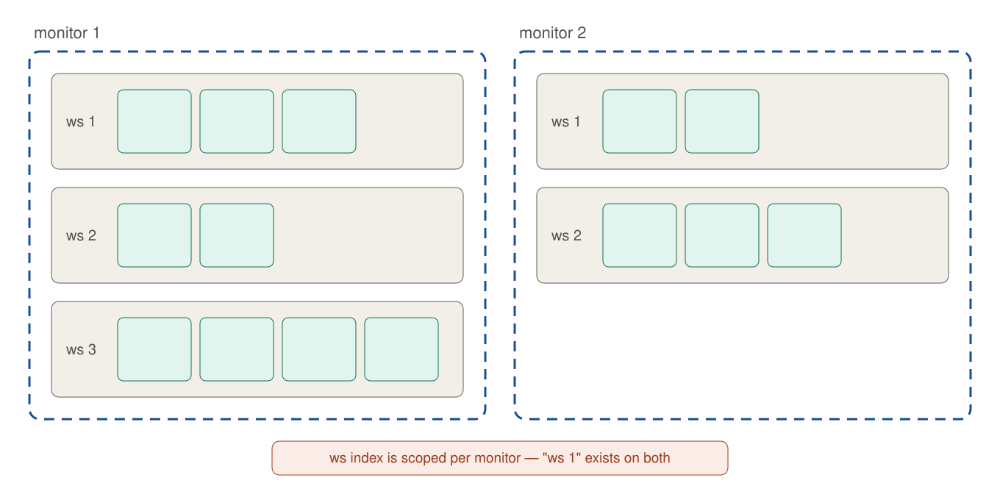
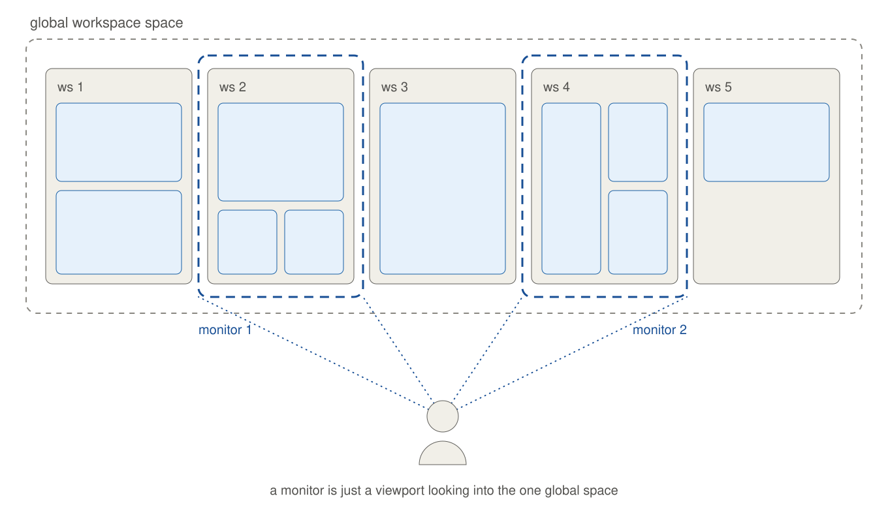
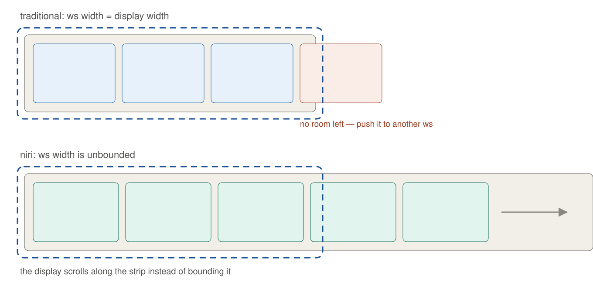

= niriにはglobal workspace indexがない

niriは各にモニターごとにworkspace一覧を持つ。そのため構造上も操作上も常にモニターが空間単位になる。

= 個人的な思想として: workspaceはglobalでありモニターはそれを覗いてる

全てのwindow(and workspace)は仮想的にglobalな空間に一覧され、それをモニターというIOデバイスで覗くようなイメージを持っている。niriはそれを崩してしまう。

= workspaceに無限の幅という思想はとても合っている

Hyprlandなどの従来のWorkspace体系ではモニターの表示領域がworkspaceの空間単位であるため、1つのworkspaceに入るwindowの数には限りがあった#footnote[GNOMEなどには最小化の機能があるので厳密に限りがあるわけではないが。またhlでもモニター上にメモリが足りうる限りのwindowをsplitしていけば無限のwindowは開けるが現実的な話ではないので]。

workspaceは作業ごとに開かれ、その作業に必要なアプリケーションとウィンドウを管理する。しかし先程のように1つのworkspaceに入るアプリケーションには限りがある。

niriはworkspaceの幅を仮想的に横スクロールで無限とすることで解決した。あと1つのworkspaceにウィンドウが増える影響かデフォルトでoverviewが組み込まれてるのも嬉しい。

= 理想はglobal index niri

ただniriはworkspaceを縦に積んでいく以上、モニター配置との相性が悪くどうしたってモニターごとにworkspaceを管理する方が自然ではあるので、きっと相容れない思想同士。
