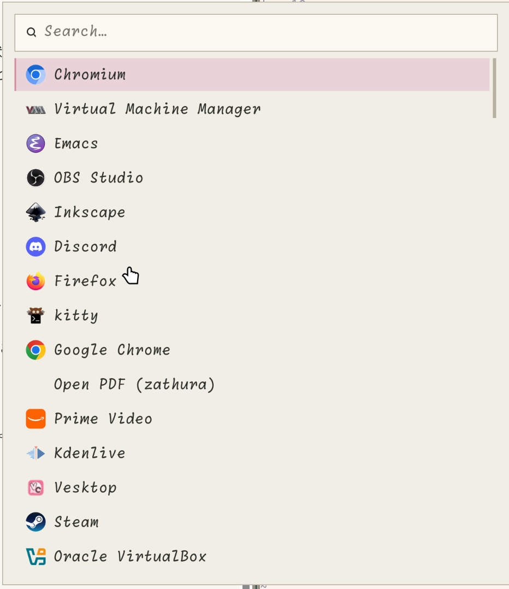
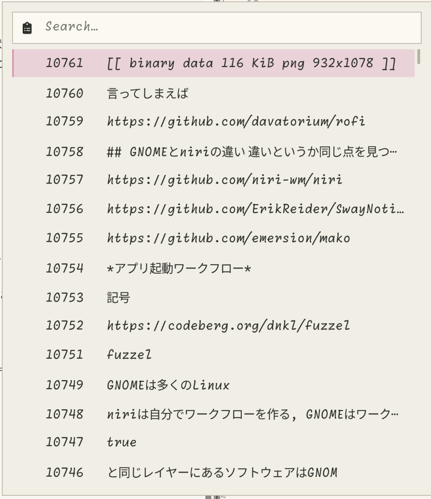
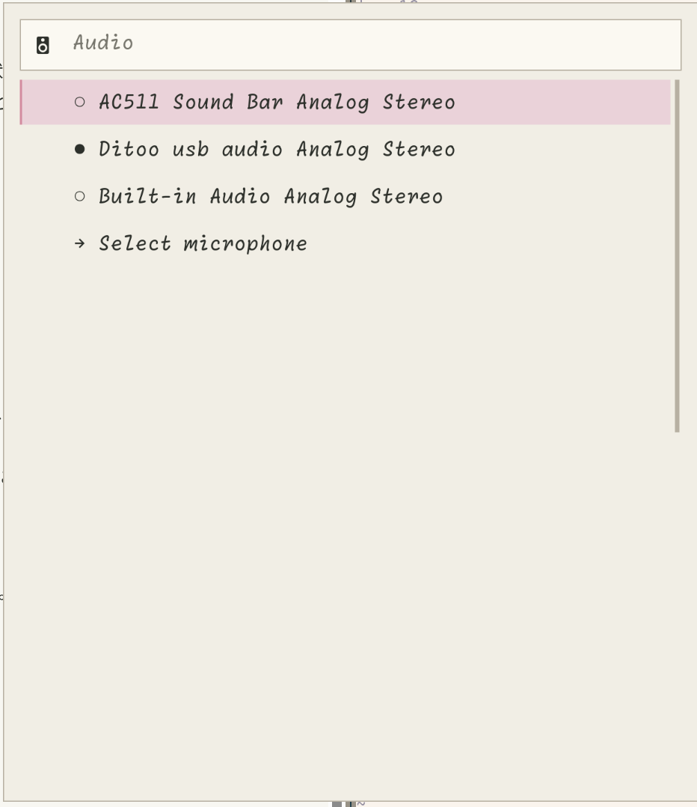

## まとめ

- 一度niriのようなワークフローに慣れるとGNOMEへの出戻りは難しい
- ウィンドウを操作するということが苦痛になる
- でもエコシステムは少し憧れるね

---

## niriはTiling WM

niriに限らず近年のlinux向けWMはTilingという形式が増えています。Tilingとは名前の通りディスプレイ領域をウィンドウをタイル状に配置するウィンドウ制御方式です。

それを採用する多くのWMがキーバインドベースの操作を要求するため、初見ハードルは少し高いですが慣れれば表示的にも操作的にも高い効率性を発揮します。またキーバインドによって決定論的にウィンドウの状態を操作するため細かいマウスの操作などが不要であるとか、コマンドによる操作も可能なのでスクリプトにまとめるなどもできます。

### Stacking, floating

Tilingとは逆に従来のウィンドウを浮かせたり重ねたりする方式をstacking型などと呼びます。GNOMEやKDEがこれにあたります。これらはマウスカーソルによる操作が前提で決まりきった操作が面倒であったりディスプレイに隙間ができたりと不便な点があります。その代わり初めてでも使いやすいですし、ちょっとウィンドウを重ねておくみたいな操作は便利です。

### Tilingは考えることを減らせる

しかしユーザーの層が元々Geekの多いLinuxではTilingが増えています。それにはおそらく考えることを減らせるというメリットのためです。

本来ウィンドウ操作において私たちの行いたいことは綺麗にウィンドウを並べることではなく、情報を表示してるウィンドウを使えるようにすることです(できれば効率的に)。*使えるように*とは例えば、必要な情報(ウィンドウ)を素早く見つけるだとか、そのために整理を行うだとかです。そしてウィンドウの配置の調整の多くはそれらを解決するために行なっています。

仮想デスクトップなどを用いてウィンドウをグループ化するのは整理のため、ウィンドウの位置を調整して必要な情報を見れるようにするのも素早く, 一覧的に情報を得るためです。

しかし、その点において手動でウィンドウを並べることは必須の条件ではないです。機械が勝手に並べてくれるならそちらの方が楽ではないか、マウスを震わせながら1文字分重なってしまったウィンドウを微調整する必要などないのではないか。

そこで人はウィンドウをタイルに見立て、ウィンドウ同士が重なることのないようにタイル状に配置していくことにしました。それがTiling WMです。ウィンドウの位置, 重なりを考えることを減らすためのツールです。

## 一度Tilingに慣れるとStackingに戻りにくい

このように便利なTilingですが慣れてしまうとそのいくつかの習性によってStackingには戻りにくくなってしまいます。

### キーバインドベース

niriをはじめとして多くのTiling WMがキーバインドベースの操作を要求します。これはマウスでボタンをカチカチするよりキーボードで操作を行った方が高速であることが多いからです。Tilingにおけるウィンドウ操作に基本的にインタラクティブ性は不要で、ユーザーの指示通りに, 宣言的にウィンドウが操作されるのみです。

しかし慣れたキーバインドが手に染み付くように、これらはデスクトップ操作という根幹に染みつきます。そんな手でGNOMEや他の環境に移れば当然フラストレーションが溜まります。

### ワークフローの違い

人に依るとは思いますが私はniriで[rofi](https://github.com/davatorium/rofi)というランチャーを多用してます。アプリケーションランチャーから、`cliphist`のセレクター、オーディオの出力先変更までrofiをインターフェースとして用いて#footnote[rofiには`-dmenu`というオプションがありこれを用いるとshellからstdinを経由して選択ランチャーのような使い方が可能です。これを使うことで簡単にGUIのセレクターをbash scriptなどに組み込めます。デスクトップ環境で用いるにはTUIなどよりGUIの方が都合がいいので便利。]います。

:::image-row

:::

こういった自分向けを環境はGNOMEやKDEといった全部載せ環境とは相性が悪く、ワークフローの変更を行わざるを得ないです。

## 具体的なフラストレーション

- ランチャーがUI遷移のせいで遅く感じる(多分実行速度は別に)#footnote[でも体感って大事で、実行時間以上にユーザー体験に直結するだろうなぁと。特に実行時間の差が1, 2secに収まっている場合は]
- 上記のrofiによる統一操作UIが作れない
- キーバインドに限界がある
    - Super単体を潰して, Super + Dとかだけにできない等々
- 見た目のカスタムが基本的にできない & 拡張機能もバージョンやら何やらで結構面倒

## しかし、エコシステムというのも便利

GNOMEにはカレンダーやメールなどと統合可能なGNOMEとしてのonline-acount連携があります。このあたりはとてもApple風味を感じます。要はGNOMEの設定でgoogleにログインするとその環境のメールクライアント(e.g. Evolution)でgmailを使えるというわけです。

確かにこういったエコシステムはとても魅力的です。実際のところGNOMEを使いたくなることもあるのですが、しばらくすると上記のようなフラストレーションでniriに戻ってしまいます。

