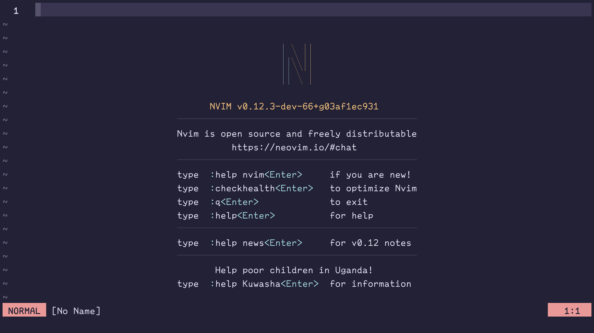

## What's Vim?

=> Text Editor.

自由で高速で効率的なエディター。

## Vim or Neovim?

VimはViをImporovedしたもの。NeovimはVimのNeoしたもの。

[Vim](https://www.vim.org/), [neovim](https://neovim.io/)

どちらもモーダル編集を持ったエディター。多くはTerminal上で動作するがGUIクライアントも存在する。

Neovimは非同期のサポートやluaでの設定ファイルサポートなど色々モダン。実はまだ0.x.y。
