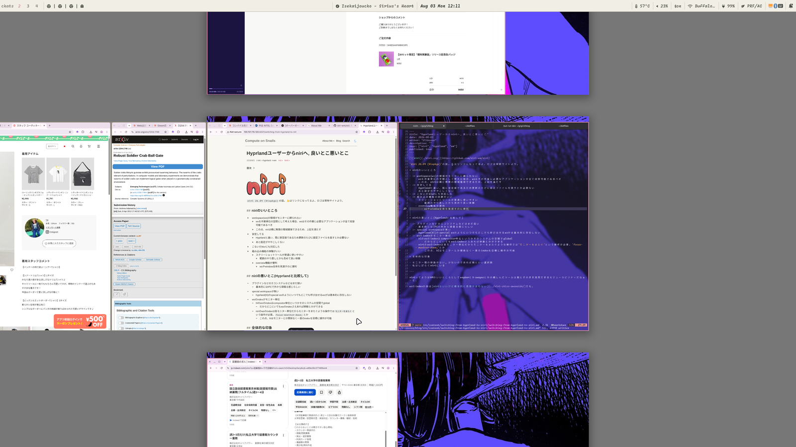

`niri 26.04 (Nixpkgs)`の話。👆はリンクになってるよ。ロゴは常時サイトより。

= niriのいいところ

- :+ workspace(ws)の領域がモニターに縛られない
  - wsを作業単位の空間として考えた場合、wsはその作業に必要なアプリケーションが全て収容可能であるべき
  - この点、niriは横に無限の領域確保できるため、上記を満たす
- :+ 安定してる
  - Hyprlandと違い、既に安定版であるため更新のたびに設定ファイルを直すとか必要ない
  - あと設定がややこしくない
- :+ こないだblurにも対応した
- :+ 組み込み機能の体験がいい
  - スクリーショットツールが普通に使いやすい
    - 範囲のやり直しとかも含めて良い体験
  - overview機能が便利
    - wsやwindow全体を見渡すのに便利

overview機能👇 `Super+h|j|k|l`で移動もできる。現在画面をそのまま縮小した感じ。

= niriの悪いとこ(Hyprlandと比較して)

- :- プラグインなどのエコシステムなどはまだ弱い
  - 基本的にはIPCで外から頑張る感じらしい
- :- special workspaceが無い
  - hyprland(hl)のspecial wsのようにいつでもどこでも呼び出せるwsがは基本的に存在しない
- :- wsのindexがモニター単位
  - hlのwsのindexはcompositor単位というかそのシステムの空間でglobal
    - だからどこにいてもwsのindexさえあれば移動とかができる
  - niriのwsのindexは各モニター単位だからモニターをまたぐような操作では`モニターをまたぐ`という操作が必要。`focus-monitor-down;`とか
    - この点、hlはモニターとか関係なく一意のindexを目標に操作が可能

= 全体的な印象

- モニター間の移動がない, 少ないのであれば割といい選択肢
- 私はしばらくniriにいる
- Hyprlandに疲れた人にちょうどいい

---

niriってよりはWMのいいところとしてwaybarとかswayncとかの親しんだツールは割とそのまま流用できるモジューラビリティだなぁと。

wsのindexの話は[niriはいいけど根本的に思想が合わない](../niri-shiso-awanaide/)でも。
