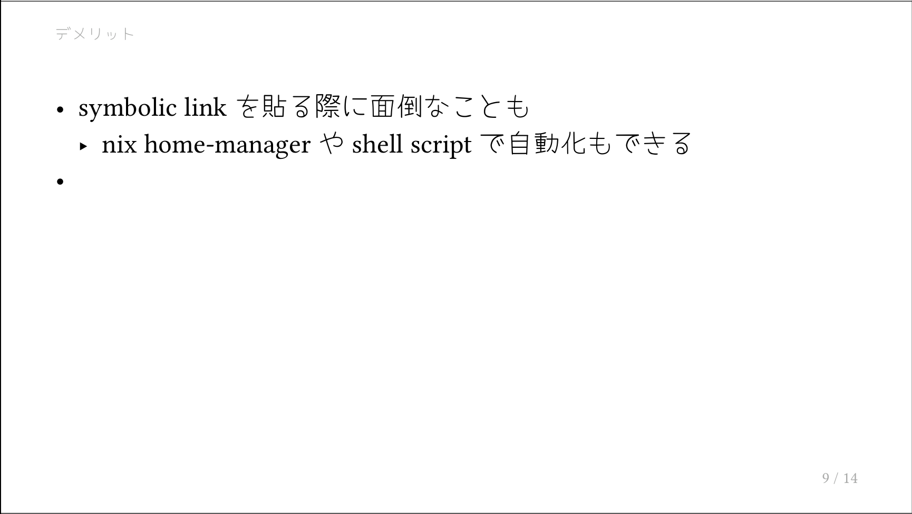
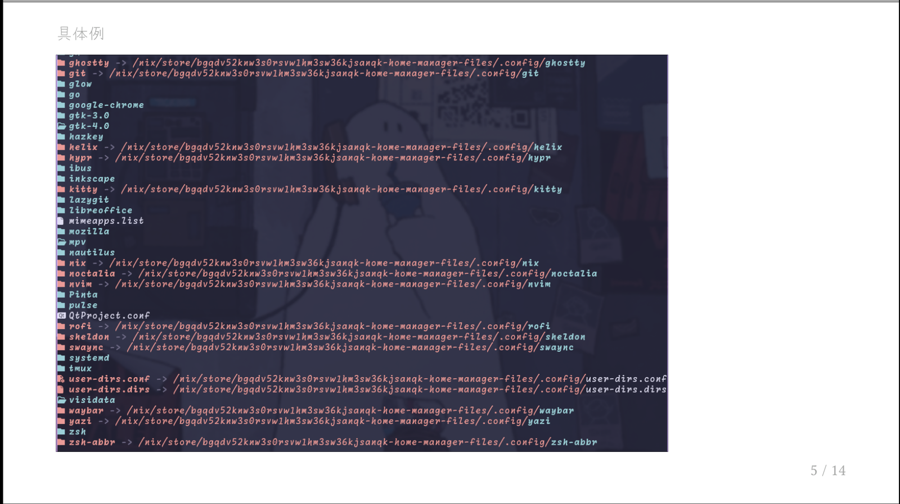
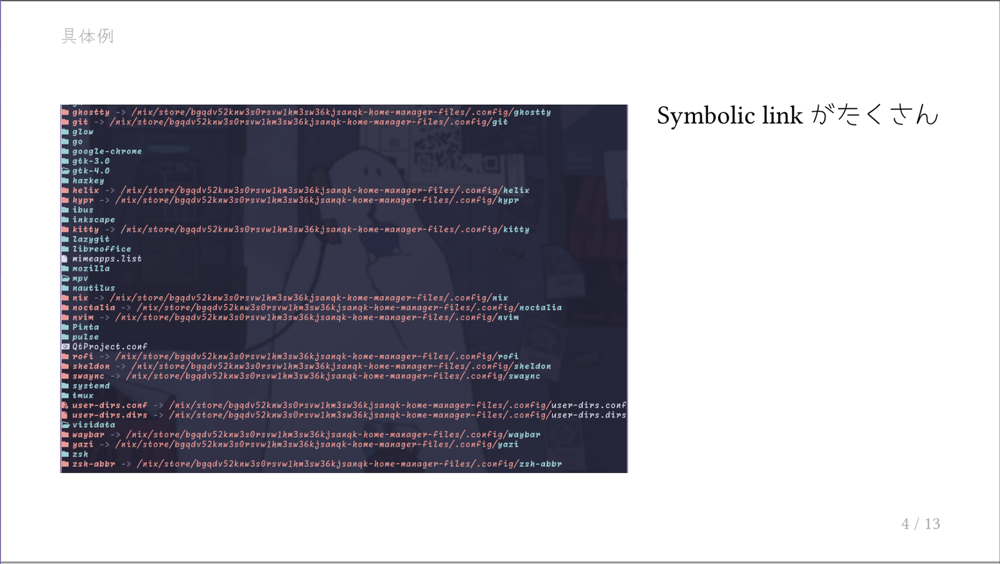
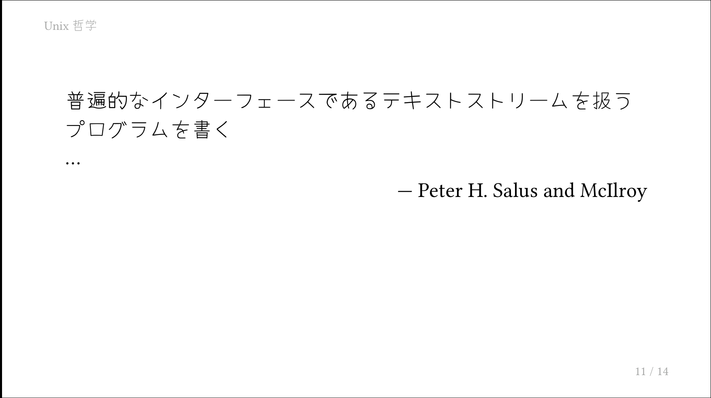
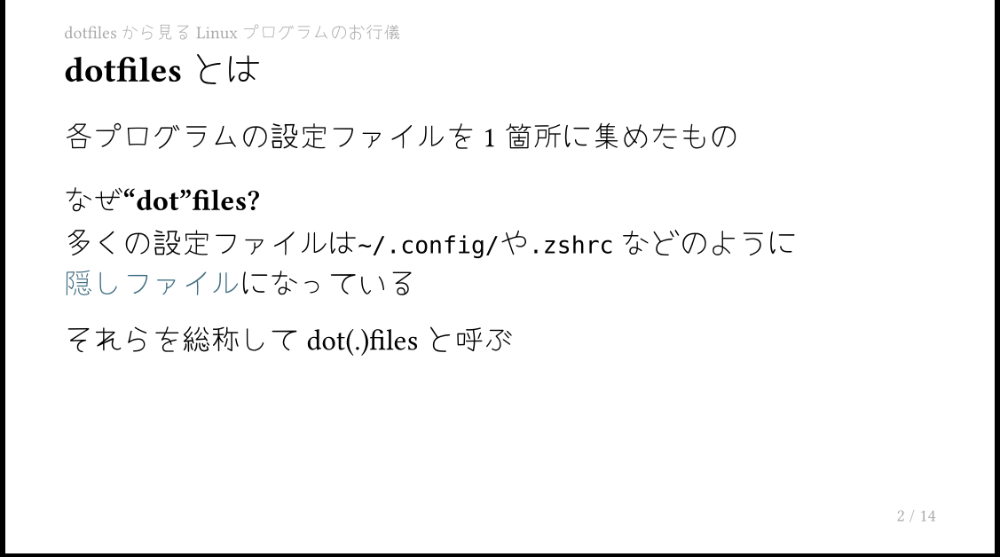
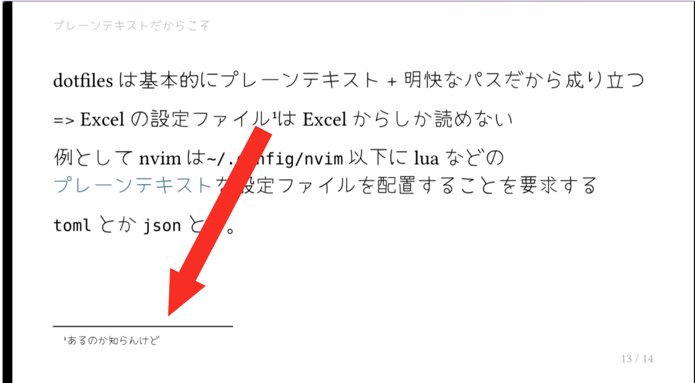

👆 **目次おすすめ**

typstでスライド(PDF)を作成するための個人的最小の知識メモです。備忘録。

Draftも多く申し訳ないけれど一応例として[dotfilesについて - github](https://github.com/Uliboooo/slides/tree/main/linux_conf_2)を共有します。

## What is Typst?

[Typst.app](https://typst.app/)。Latexなどの組版システム。シンプルでモダン。CompilerがRust製らしい。

## スライドにするには

以下の設定を用いることで`typsyt->Slide(PDF)`が行える。`touying`というプラグイン?を使うことでスライド用にPDFエクスポートできるよう。基本的にはtypstの構文が使え、その上に`touying`によるページ切り替えなどのスライド用の機能が乗っかるらしい。[^1]

```typst
#import "@preview/touying:0.7.4": *
#import themes.simple: *

#show: simple-theme.with(
  aspect-ratio: "16-9",
)
```

## ページ切り替え: `=`

level 1 headingによってスライドが切り替わる。level 1はそのページの前に全画面のheadingページが挟まり、次にコンテンツとともに左上に小さくlevel 1 headingの内容が表示される。

level 2,3はそれぞれ小見出しになる。

```typst
= メリット

- 複数の環境で設定を共有できる
- git repositoryにすることでコンフリクト対策も
- 設定のバックアップ的な

= デメリット

- symbolic linkを貼る際に面倒なことも
  - nix home-managerやshell scriptで自動化もできる
-
```

:::image-row


:::

:::image-row


:::

## 画像挿入

```typst
= 具体例

#image("ls_config.png")
```



## 画像とテキストを横並び

```typst
#grid(
  // frは割合。この場合gridを2:1に分割
  columns: (2fr, 1fr),
  column-gutter: 1em,

  // widthは画像に割り当てらた幅を100としてさらに調整できる
  image("ls_config.png", width: 100%),

  text(size: 22pt)[
    Symbolic linkがたくさん
  ],
)
```



余談ですがtypstで`#grid()`などの関数内に入ってしまえばマークアップからコードに切り替わっているので`#text()`などと`#`をつけることは不要だそう。(というかlspがerror出した)

## 引用

```typst
#quote(
  block: true,
  attribution: [
    Peter H. Salus and McIlroy
  ],
)[
  普遍的なインターフェースであるテキストストリームを扱うプログラムを書く \
  ...
]
```



## 表示のアニメーション

`#pause`というコマンドを挟むことで一度表示を止めるアニメーションを挟むことが可能。

PDFにexportする関係上、アニメーションというよりはそのエフェクトを用いた場合のフレームを1枚ずつPDFに変換する。

```typst
= dotfilesから見るLinuxプログラムのお行儀

== dotfilesとは

各プログラムの設定ファイルを1箇所に集めたもの

#pause

=== なぜ"dot"files?

多くの設定ファイルは`~/.config/`や`.zshrc`などのように#box[*隠しファイル*]になっている

それらを総称してdot(.)filesと呼ぶ

```

は以下の2枚のPDFページとなって生成される。これを1枚ずつ全画面表示できるPDFビューア(`pdfpc`とか)。

:::image-row


:::

## 意図しない改行を防ぐ

`#box[word]`とboxで囲むことでその文字列内では改行されなくなる。

```typst
=== なぜ"dot"files?

多くの設定ファイルは`~/.config/`や`.zshrc`などのように#box[*隠しファイル*]になっている

それらを総称してdot(.)filesと呼ぶ
```

## 注釈

基本的に素の`typst`と同様。

```typst
=> Excelの設定ファイル#footnote[あるのか知らんけど]はExcelからしか読めない
```



## Compile to PDF

```bash
typst compile slide.typ

# watchを使うと常時compileされるため実質的なリアルタイムプレビューになる
typst watch slide.typ
```

`Zathura`あたりのPDFプレビューで見ていれば良さげ。

## まとめ?

- typstをそのまま使えるのでフォントの調整とかが楽
- markdownより厳密? (あんまり知らない)
- PDFにしておけるので再生機器に困らない
- PPTに触らずに済む

[^1]: そもそも私はtypstをちゃんと知らないのでそこからという話はある。
