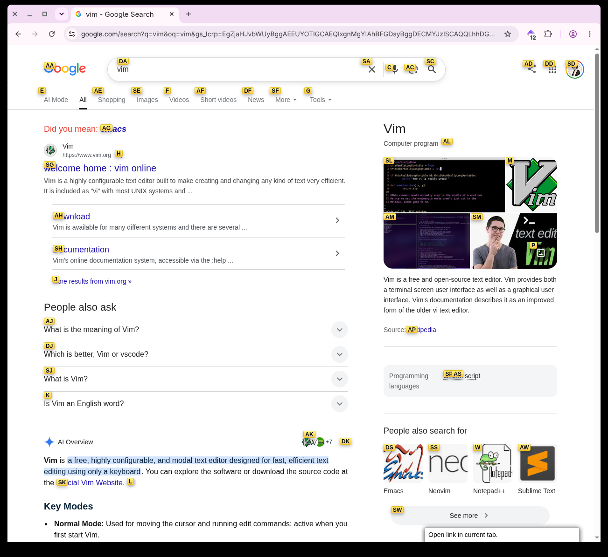
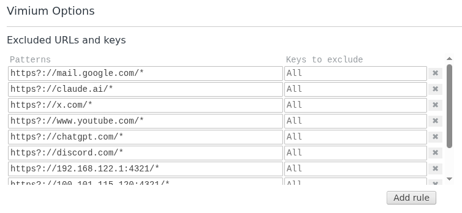
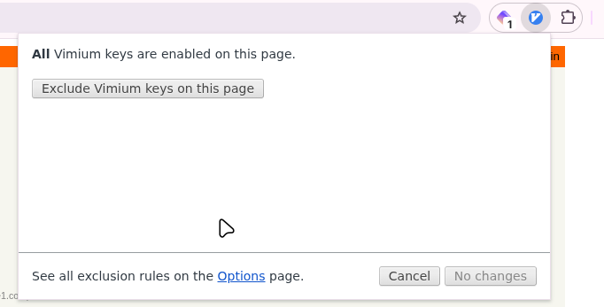

= Vivium

[Chrome拡張機能](https://chromewebstore.google.com/detail/vimium/dbepggeogbaibhgnhhndojpepiihcmeb)

ブラウザの操作をVimぽくできる拡張機能。色々できるぽいけれど、私は最小限の機能しか使っていない。

== スクロール: `j/k`

シンプルにj/kでページのスクロールができる。

== リンクへ: `f` -> `id`

`f`を押すと各リンクに固有のidが付されるので、次のワードとしてそれにジャンプできる。下記の状態では`SG`を押すことでvimの公式サイトへいける。



== ブラウザ操作

`t`でnew tab, `x`でclose tabができる。個人的には`Ctrl + t/w`の方が好みなのであんまり使ってはいない。

== 特定のサイトでvimを外す

後述するような既にキーバインドに対応したサイトではvimiumとそのキーの奪い合いになるため、Excluded URLsに追加する必要がある。



現在のサイトを除外するのであれば右上の拡張機能のボタンをクリックすると以下のUIで除外できる。



このブログサイトはvimキーバインドもどきに対応しているため、除外リストに追加しておくのがおすすめ。以下は私が除外しているサイト一覧。([一応設定ファイルもこちらに](https://gist.github.com/senox78/3acde90b57dddfc7a6ba12abde41f6c1))

```shell
:) jq '.exclusionRules[].pattern' Downloads/vimium-options.json
"https?://mail.google.com/*"
"https?://claude.ai/*"
"https?://x.com/*"
"https?://www.youtube.com/*"
"https?://chatgpt.com/*"
"https?://discord.com/*"
"https?://192.168.122.1:4321/*"
"https?://100.101.115.120:4321/*"
"https?://senox.cc/blog/*"
"https?://github.com/*"
```

= 既にキーバインドのあるサイト

このサイトのように既にキーバインドが存在しているサイトもあります。その際はvimiumを上記のように設定すればいいです。

ここでは私の普段使っているサイトでのキーバインドの使い方をメモしておきます。

== Twitter.com (x.com)

|  key  |              desc              |
| :---: | :----------------------------: |
|  `n`  |          ポストの作成          |
| `j/k` | 上下のポストへ移動(フォーカス) |
|  `r`  |            リプライ            |
|  `t`  |    リポスト/引用のメニュー     |
|  `l`  |              like              |
| `gh`  |           goto home            |
| `gn`  |    goto notification center    |
| `gm`  |            goto DM             |

== Discord

詳細は[過去記事: Discord hotkey](../discord_hostkey)を。

- Ctrl + kで検索ボックス
  - ボックス内で以下のショートハンド
    - `@ 人`
    - `$ チャンネル`
    - `! ボイスチャンネル`
    - `* サーバー名`
- `Alt + arrow key`で現在のサーバーのチャンネルを移動できる

== AI系

`Ctrl + o`で新規チャット。

くらい? あんまりキーバインドあってもね...

== Youtube

| key |     desc     |
| :-: | :----------: |
| `0` |    先頭へ    |
| `k` | pause / play |
| `c` |  字幕トグル  |

他にあるけどあんまり使ってない。UIにカーソルを当てるとキーバインドが表示される。
