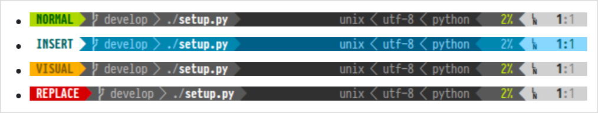
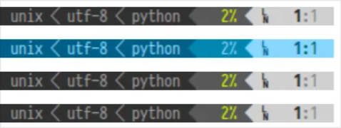

= powerlineとは

#quote(attribution: "powerline - github", url:"https://github.com/powerline/powerline")[
Powerline is a statusline plugin for vim, and provides statuslines and prompts for several other applications, including zsh, bash, tmux, IPython, Awesome and Qtile.
]

> Powerlineはvim用のステータスライン・プラグインであり、zsh、bash、tmux、IPython、Awesome、Qtileなど、いくつかの他のアプリケーション向けにステータスラインとプロンプトを提供します。

だそうです。まあ👇です。

== 色んなところで使える

上記の例はshellのpromptでしたが、kittyのtabやvimのstatus line, WMのbar, etc... 情報が横並びになる場所には大体powerlineが提供されています。

== セパレータが矢印

powerlineの特徴としては矢印でセクションやパーツを区切る感じです。

上記の画像を見てもわかる通り、矢印のような記号を用いて情報を並べます。`<`というよりはnerd icon使って``などを色つけして表示していく感じです。

= あんまり好きじゃない

何が嫌いかと言えば、矢印がセパレータになっていることです。

vimのstatus lineなどは基本的に順序性の無い情報を並べるわけで、それらを専ら順序や大小関係を示すことに使われる矢印を意味する記号で区切るというのは少し意味がズレているように感じます。

設定でどうにでも変えられるのはそうですが、それならばわざわざpowerlineである必要もないわけで。

例えば👇の画像は私のnvimのstatus lineですが、そこにある情報は`[mode branch diff path] [size lang position]`でありそれらは基本的に順序的な関連を持たないため、シンプルな長方形で区切っています。

しかし先程のpowerlineの例にある`unix < utf-8 < python < 2% < 1:1`は情報として順序的, 大小的関係はないのに、まるでunixの上にutf-8が存在するような表示になってしまっています。

= パスの表示とかは向いてると思う

当然パスなんて大小、というか親子関係の連続なのでとても向いています。

shellのpromptのパス表示とかはすごいいいのでは。

それをなんでもかんでもどこでもpowerlineにするのがどうなんだ? という話です。
